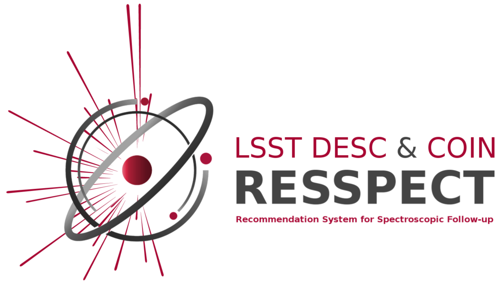

#  RESSPECT

## Recommendation System for Spectroscopic follow-up 

This repository holds the pipeline of the RESSPECT project, built as part of the inter-collaboration activities developed by the Cosmostatistics Initiative ([COIN](cosmostatistics-initiative.org)) and the LSST Dark Energy Science Collaboration ([DESC](https://lsstdesc.org/)).

This work grew from activities developed within the [COIN Residence Program #4](http://iaacoin.wix.com/crp2017), using as a starting point their [ActSNClass](https://github.com/COINtoolbox/ActSNClass) software. We kindly ask you to include the full citation to the original work if you use this material in your research: [Ishida et al, 2019, MNRAS, 483 (1), 2–18](https://cosmostatistics-initiative.org/wp-content/uploads/2019/06/COIN_ActSNClass.txt).

Full documentation can be found at [readthedocs](https://resspect.readthedocs.io/en/latest/).

# Dependencies

### For code:

 - Python>=3.7  
 - argparse>=1.1  
 - astropy>=4.0  
 - matplotlib>=3.1.1  
 - numpy>=1.17.0  
 - pandas>=0.25.0  
 - setuptools>=41.0.1  
 - scipy>=1.3.0  
 - scikit-learn>=0.20.3  
 - seaborn>=0.9.0  
 
 
 ### For documentation:
 
  - sphinx>=2.1.2

# Install

The current version runs in Python-3.7 or higher and it was not tested on Windows.  

We recommend that you work within a [virtual environment](https://packaging.python.org/guides/installing-using-pip-and-virtual-environments/).  
 
You will need to install the `Python` package ``virtualenv``. In MacOS or Linux, do

    >> python3 -m pip install --user virtualenv

Navigate to a ``env_directory`` where you will store the new virtual environment and create it  

    >> python3 -m venv RESSPECT  

> Make sure you deactivate any ``conda`` environment you might have running before moving forward.   

Once the environment is set up you can activate it,

    >> source <env_directory>/bin/activate  

You should see a ``(RESSPECT)`` flag in the extreme left of terminal command line.   

Next, clone this repository in another chosen location:  

    (RESSPECT) >> git clone https://github.com/COINtoolbox/RESSPECT.git  

Navigate to the repository folder and do  

    (RESSPECT) >> pip install -r requirements.txt  

You can now install this package with:  

    (RESSPECT) >>> python setup.py install  

> You may choose to create your virtual environment within the folder of the repository. If you choose to do this, you must remember to exclude the virtual environment directory from version control using e.g., ``.gitignore``.   
