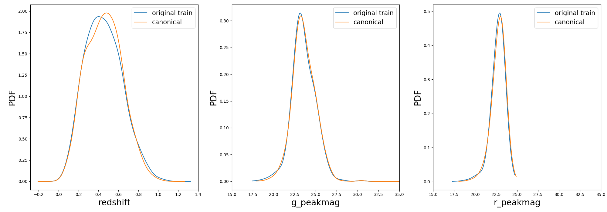
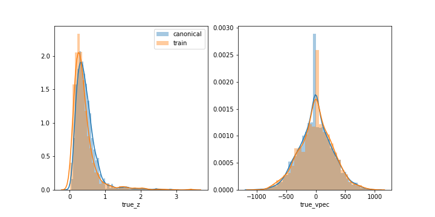

.. _canonical:

Building the Canonical sample
=============================

According to the nomenclature used in `Ishida et al., 2019 <https://arxiv.org/pdf/1804.03765.pdf>`_, the Canonical
sample is a subset of the test sample chosen to hold the same characteristics of the training sample. It was used
to mimic the effect of continuously adding elements to the training sample under the traditional strategy.

For SNPCC
---------

The canonical sample is constructed using the following steps:

#. From the raw light curve files, build a metadata matrix containing:
   ``[snid, sample, sntype, z, g_pkmag, r_pkmag, i_pkmag, z_pkmag, g_SNR, r_SNR, i_SNR, z_SNR]``
   where ``z`` corresponds to redshift, ``x_pkmag`` is the simulated peak magnitude and ``x_SNR``
   denotes the mean SNR, both in filter x;
#. Separate original training and test set in 3 subsets according to SN type: [Ia, Ibc, II];
#. For each object in the training sample, find its nearest neighbor within objects of the test sample of the
   same SN type and considering the photometric parameter space built in step 1.

This will allow you to construct a Canonical sample holding the same characteristics and size of the original training sample
but composed of different objects.

``resspect`` allows you to perform this task using the py:mod:`resspect.build_snpcc_canonical` module:

.. code-block:: python
   :linenos:

   >>> from resspect import build_snpcc_canonical

   >>> # define variables
   >>> data_dir = 'data/SIMGEN_PUBLIC_DES/'
   >>> output_sample_file = 'results/Bazin_SNPCC_canonical.csv'
   >>> output_metadata_file = 'results/Bazin_metadata.csv'
   >>> features_file = 'results/Bazin.csv'

   >>> sample = build_snpcc_canonical(path_to_raw_data=data_dir, path_to_features=features_file,
   >>>                               output_canonical_file=output_sample_file,
   >>>                               output_info_file=output_metadata_file,
   >>>                               compute=True, save=True)

Once the samples is constructed you can compare the distribution in ``[z, g_pkmag, r_pkmag]`` with a plot:

.. code-block:: python
   :linenos:

   >>> from resspect import plot_snpcc_train_canonical

   >>> plot_snpcc_train_canonical(sample, output_plot_file='plots/compare_canonical_train.png')

In the command line, using the same parameters as in the code above, you can do all at once:

.. code-block:: bash

    >>> build_canonical.py -c <if True compute metadata>
    >>>       -d <path to raw data dir>
    >>>       -f <input features file> -m <output file for metadata>
    >>>       -o <output file for canonical sample> -p <comparison plot file>
    >>>       -s <if True save metadata to file>

You can check that the file ``results/Bazin_SNPCC_canonical.csv`` is very similar to the original features file.
The only difference is that now a few of the ``queryable`` column marks the Canonical sample as ``True''.

This means that you can use the :py:mod:`resspect.learn_loop` module in combination with a ``RandomSampling`` strategy but
reading data from the canonical sample. In this way, at each iteration the code will select a random object from the test sample, 
but a query will only be made if the selected object belongs to the canonical sample.

In the command line, this looks like:

.. code-block:: bash

   >>> run_loop.py -i results/Bazin_SNPCC_canonical.dat -b <batch size> -n <number of loops>
   >>>             -m <output metrics file> -q <output queried sample file>
   >>>             -s RandomSampling -t <choice of initial training>
   
   
For PLAsTiCC
------------

In this data set we were restricted to the metadata available in the public zenodo files, so the canonical sample is constructed considering nearest neighbors only in redshift.

It can be done using:

.. code-block:: python
   :linenos:

   >>> from resspect import build_plasticc_canonical

   >>> n_neighbors = 5                   # necessary to build a sample with ~ 3000 objects
   
   >>> path_to_metadata = {}
   >>> path_to_metadata['train'] = '~/PLAsTiCC_zenodo/plasticc_train_metadata.csv'
   >>> path_to_metadata['test'] = '~/PLAsTiCC_zenodo/plasticc_test_metadata.csv.gz'

   >>> # these are files with already calculated features
   >>> fnames = ['~/plasticc_test_bazin_extragal_DDF.csv.gz',
                 '~/plasticc_validation_bazin_extragal_DDF.csv.gz',
                 '~/plasticc_pool_bazin_extragal_DDF.csv.gz']
                 
   >>> output_canonical_file = 'plasticc_canonical_bazin_extragal_DDF.csv'
   >>> output_meta_file = 'plasticc_canonical_meta_extragal_DDF.csv'
   
   >>> screen = True
   >>> plot = True
   >>> plot_fname = 'compare_train_canonical.png'
   
   >>> build_plasticc_canonical(n_neighbors=n_neighbors, path_to_metadata=path_to_metadata,
                                path_to_features=fnames,
                                output_canonical_file=output_canonical_file,  
                                output_meta_file=output_meta_file,
                                screen=screen, plot=plot, 
                                plot_fname=plot_fname)
                               
This will generate the comparison plot in redshift and ``true_vspec`` (shown only for illustration, ``true_vspec`` was not used in calculations):

   
   
In the example above we performed the entire operation using only extragalactic models observed in deep drilling fields (DDF). This reduced considerably the data set size and corresponding computational time. 

The output file  ``plasticc_canonical_bazin_extragal_DDF.csv`` is now a completely separate pool sample.   
In order to perform the canonical loop we should declare it as completely separate from the training and validation.

.. warning:: Before you proceed with the loop, make sure you remove eventual objects in the canonical sample which are also present in the validation and test  samples! In the example below we removed repeated objects and stored the new data sets into specific files for the canonical sample.

The active learning loop using the canonical sample can be ran using:

.. code-block:: python
   :linenos:

   >>> from resspect.learn_loop import learn_loop
   
   >>> nloops = 3000
   >>> train = 'original'                      # initial training
   >>> strategy = 'RandomSampling'             # learning strategy
   >>> method = 'Bazin'                        # only option in v1.0
   >>> ml = 'RandomForest'                     # classifier
   >>> n_estimators = 1000                     # classifier parameters

   >>> metric = 'metrics_canonical.dat'                 # output metrics file
   >>> queried = 'queried_canonical.dat'                # output query file
  
   >>> batch = 1                                        # size of batch
   >>> survey = 'LSST'
   
   >>> screen = True                                    # print steps on screen
   
   >>> path_to_features = {}
   >>> path_to_features['train'] = '~/plasticc_train_bazin_extragal_DDF.csv.gz'
   >>> path_to_features['test'] = '~/plasticc_test_canonical_bazin_extragal_DDF.csv'
   >>> path_to_features['validation'] = '~/plasticc_validation_canonical_bazin_extragal_DDF.csv'
   >>> path_to_features['pool'] = '~/plasticc_pool_canonical_bazin_extragal_DDF.csv'

   >>> learn_loop(batch=batch, classifier=ml, features_method=method, n_estimators=n_estimators,
   >>>            nloops=nloops, output_metrics_file=metric, output_queried_file=queried,
   >>>            path_to_features=path_to_features, screen=screen, strategy=strategy,
   >>>            survey=survey, training=train)
