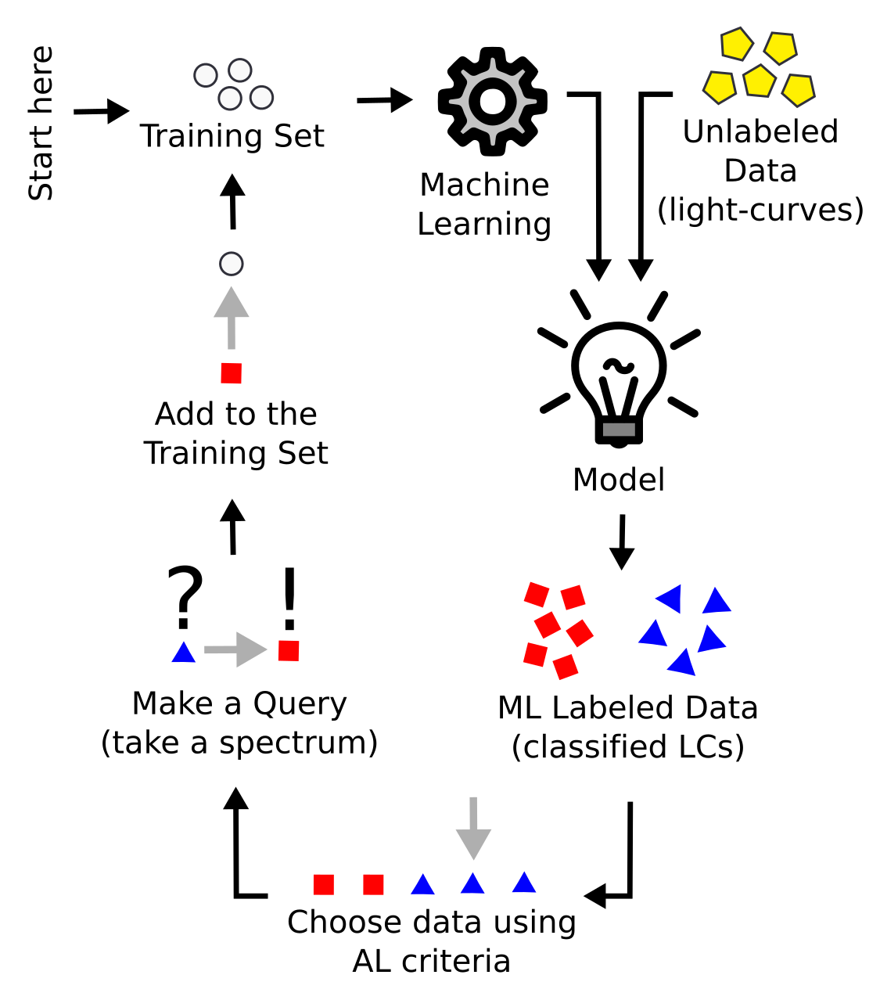

===================
Welcome to RESSPECT
===================
-------------------------------------------------
Recommendation System for Spectroscopic Follow-up
-------------------------------------------------

This tool allows the constructon of an optimized spectroscopic observation strategy which enables photometric supernova cosmology. It was developed as a collaboration between the LSST DESC and the Cosmostatistics Initiative.

This grew from the work presented in `Ishida et al., 2019 <https://cosmostatistics-initiative.org/portfolio-item/active-learning-for-sn-classification/>`_ and implemented in the `actsnclass <https://github.com/COINtoolbox/ActSNClass>`_ package.

The RESSPECT active learning and telescope resources pipeline is described in `Kennamer et al, 2020 <https://cosmostatistics-initiative.org/portfolio-item/resspect1/>`_. We kindly ask you to include its full citation if you use this material in your research.

The code has been modify for the task of enabling photometric supernova cosmology.

Getting started
===============

This code was developed for ``Python3`` and was not tested in Windows.

We recommend that you work within a `virtual environment <https://packaging.python.org/guides/installing-using-pip-and-virtual-environments/>`_.

You will need to install the `Python` package ``virtualenv``. In MacOS or Linux, do

.. code-block:: bash

   >>> python3 -m pip install --user virtualenv

Navigate to a ``working_directory`` where you will store the new virtual environment and create it:

.. code-block:: bash

    >>> python3.10 -m venv resspect

.. hint:: Make sure you deactivate any ``conda`` environment you might have running before moving forward.

Once the environment is set up you can activate it:

.. code-block:: bash

   >>> source <working_directory>/bin/activate

You should see a ``(resspect)`` flag in the extreme left of terminal command line.

Next, clone this repository in another chosen location:

.. code-block:: bash

    (resspect) >>> git clone https://github.com/COINtoolbox/resspect

Navigate to the repository folder and you can now install this package with:

.. code-block:: bash

    (resspect) >>> pip install -e .

Setting up a working directory
------------------------------

In a your choosing, create the following directory structure:

::

    work_dir
    ├── plots
    ├── results

The outputs of ``resspect`` will be stored in these directories.

In order to set things properly, navigate to the repository you just cloned and move the data directory to your
chosen working directory and unpack the data.

.. code-block:: bash

    >>> mv -f resspect/data/ work_dir/
    >>> cd work_dir/data
    >>> tar -xzvf SIMGEN_PUBLIC_DES.tar.gz

This data was provided by Rick Kessler, after the publication of results from the
`SuperNova Photometric Classification Challenge <https://arxiv.org/abs/1008.1024>`_ (SNPCC).
It allows you to run tests and validate your installation.

Analysis steps
==============

   Figure by Bruno Quint.

The active learning pipeline is composed of 4 important steps:

1. Feature extraction

2. Classifier

3. Query Strategy

4. Metric evaluation

These are arranged in the adaptable learning process (figure to the right).

Using this package
------------------

Step 1 is considered pre-processing. The current code does the feature extraction
using the `Bazin parametric function <https://arxiv.org/abs/0904.1066>`_ for the complete training and test sample
before any machine learning application is used.

Details of the tools available to evaluate different steps on feature extraction can be found in the
:ref:`Feature extraction page <preprocessing>`.

Alternatively, you can also perform the full light curve fit for the entire sample from the command line.

If you are only interested in testing your installation you should work with the SNPCC data:

.. code-block:: bash

   >>> fit_dataset.py -s SNPCC -dd <path_to_data_dir> -o <output_file>

Once the data has been processed you can apply the full Active Learning loop according to your needs.
A detail description on how to use this tool is provided in the :ref:`Learning Loop page <learnloop>`.

The command line option require a few more inputs than the feature extraction stage, but it is also available:

.. code-block:: bash

   >>> run_loop.py -i <input features file> -b <batch size> -n <number of loops>
   >>>             -d <output metrics file> -q <output queried sample file>
   >>>             -s <learning strategy> -t <choice of initial training>

We also provide detail explanation on how to use this package to produce other stages of the pipeline like:
:ref:`prepare the Canonical sample <canonical>`, :ref:`prepare data for time domain <timedomain>` and
:ref:`produce plots <plotting>`.

We also provide detail descriptions on how to contribute with other modules in the
:ref:`How to contribute <contribute>` tab.

Enjoy!!

Acknowledgements
****************

This work is part of the Recommendation System for Spectroscopic Followup (RESSPECT) project, governed by an inter-collaboration agreement signed between the `Cosmostatistics Initiative (COIN) <https://cosmostatistics-initiative.org/>`_ and the `LSST Dark Energy Science Collaboration (DESC) <https://lsstdesc.org/>`_.

The `COsmostatistics INitiative (COIN) <https://cosmostatistics-initiative.org>`_ is an international network of researchers whose goal is to foster interdisciplinarity inspired by Astronomy.

COIN received financial support from `CNRS <http://www.cnrs.fr/>`_ for the development of this project, as part of its MOMENTUM programme over the 2018-2020 period, under the project *Active Learning for Large Scale Sky Surveys*.

This work would not be possible without intensive consultation to online platforms and
discussion forums. Although it is not possible to provide a complete list of the open source
material consulted in the construction of this material, we recognize their importance and
**deeply thank all those who contributes to open learning platforms**.

Dependencies
------------

``resspect`` was developed under ``Python3``. The complete list of dependencies is given below:

 - Python>=3.8
 - astropy>4.0
 - matplotlib>=3.1.1
 - numpy>=1.17.0
 - pandas>=0.25.0
 - setuptools>=41.0.1
 - scipy>=1.3.0
 - sklearn>=0.20.3
 - seaborn>=0.9.0

Table of Contents
=================

.. toctree::
   :maxdepth: 2

   pre_processing
   canonical
   prepare_time_domain
   learn_loop
   plotting
   contribute
   reference

Indices and tables
==================

* :ref:`genindex`
* :ref:`modindex`
* :ref:`search`
