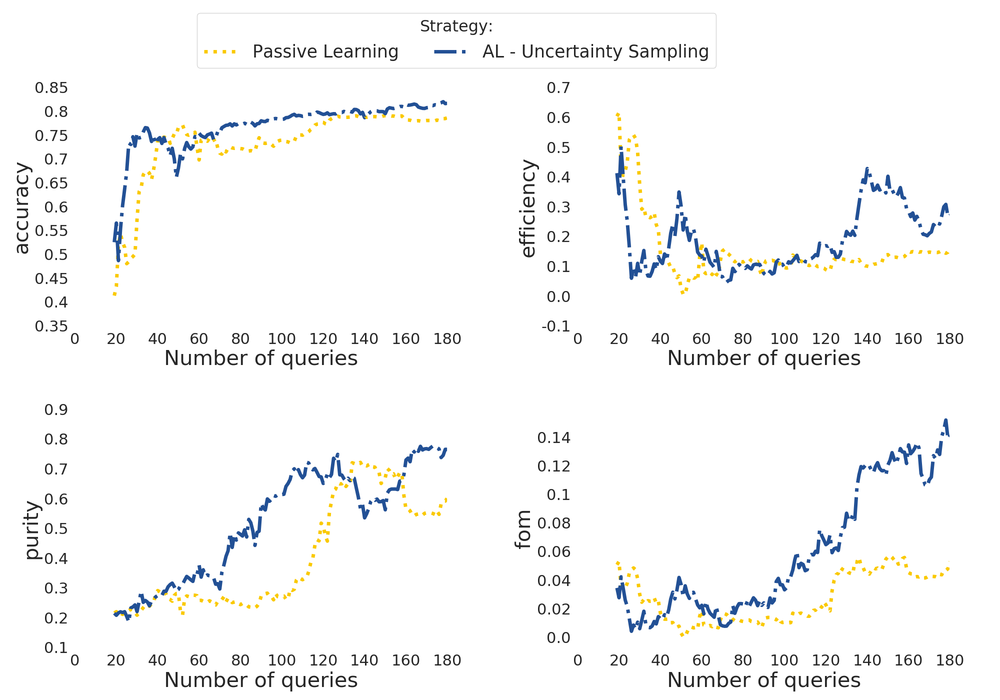

.. _learnloop:

Active Learning loop
====================

Details on running 1 loop
-------------------------

Once the data has been pre-processed, analysis steps 2-4 can be performed directly using the ``DataBase`` object.

For start, we can load the feature information:

.. code-block:: python
   :linenos:

   >>> from resspect import DataBase

   >>> path_to_features_file = 'results/Bazin.csv'

   >>> data = DataBase()
   >>> data.load_features(path_to_features_file, feature_extractor='bazin', screen=True)
   Loaded  21284  samples!

Notice that this data has some pre-determine separation between training and test sample:

.. code-block:: python
   :linenos:

   >>> data.metadata['orig_sample'].unique()
   array(['test', 'train'], dtype=object)

You can choose to start your first iteration of the active learning loop from the original training sample
flagged int he file OR from scratch. As this is our first example, let's do the simple thing and start from the original
training sample. The code below build the respective samples and performs the classification:

.. code-block:: python
   :linenos:

   >>> data.build_samples(initial_training='original', nclass=2, screen=True)
   ** Inside build_orig_samples: **
      Training set size:  1093
      Test set size:  20191
      Validation set size:  20191
      Pool set size:  20191
         From which queryable:  20191 

   >>> data.classify(method='RandomForest')
   >>> data.classprob                        # check classification probabilities
   array([[0.461, 0.539],
          [0.346, 0.654],
          ...,
          [0.398, 0.602],
          [0.396, 0.604]])

.. hint:: If you wish to start from scratch, just set the `initial_training=N` where `N` is the number of objects in you want in the initial training. The code will then randomly select `N` objects from the entire sample as the initial training sample. It will also impose that at least half of them are SNe Ias.

For a binary classification, the  output from the classifier for each object (line) is presented as a pair of floats, the first column
corresponding to the probability of the given object being a Ia and the second column its complement.

Given the output from the classifier we can calculate the metric(s) of choice:

.. code-block:: python
   :linenos:

   >>> data.evaluate_classification(metric_label='snpcc')
   >>> print(data.metrics_list_names)           # check metric header
   ['acc', 'eff', 'pur', 'fom']

   >>> print(data.metrics_list_values)          # check metric values
   [0.5975434599574068, 0.9024767801857585,
   0.34684684684684686, 0.13572404702012383]

Running a number of iterations in sequence
------------------------------------------

We provide a function where all the above steps can be done in sequence for a number of iterations.
In interactive mode, you must define the required variables and use the :py:mod:`resspect.learn_loop` function:

.. code-block:: python
   :linenos:

   >>> from resspect.learn_loop import  learn_loop

   >>> nloops = 1000                                  # number of iterations
   >>> method = 'bazin'                               # only option in v1.0
   >>> ml = 'RandomForest'                            # classifier
   >>> strategy = 'RandomSampling'                    # learning strategy
   >>> input_file = 'results/Bazin.csv'               # input features file
   >>> metric = 'results/metrics.csv'                 # output metrics file
   >>> queried = 'results/queried.csv'                # output query file
   >>> train = 'original'                             # initial training
   >>> batch = 1                                      # size of batch

   >>> learn_loop(nloops=nloops, features_method=method, classifier=ml,
   >>>            strategy=strategy, path_to_features=input_file, output_metrics_file=metric, 
   >>>            output_queried_file=queried, training=train, batch=batch)

Alternatively you can also run everything from the command line:

.. code-block:: bash

   >>> run_loop -i <input features file> -b <batch size> -n <number of loops>
   >>>             -m <output metrics file> -q <output queried sample file>
   >>>             -s <learning strategy> -t <choice of initial training>

Active Learning loop in time domain
===================================

Considering that you have previously prepared the time domain data, you can run the active learning loop
following the same algorithm described in `Ishida et al., 2019 <https://cosmostatistics-initiative.org/portfolio-item/active-learning-for-sn-classification/>`_    by using the :py:mod:`resspect.time_domain_loop` module.

.. note:: The code below requires a file with features extracted from full light curves from which the initial sample will be drawn.

.. code-block:: python
    :linenos:

    >>> from resspect import time_domain_loop
    
    >>> days = [20, 180]                                # first and last day of the survey
    >>> training = 'original'                           # if int take int number of objs 
                                                        # for initial training, 50% being Ia

    >>> strategy = 'UncSampling'                        # learning strategy
    >>> batch = 1                                       # if int, ignore cost per observation, 
                                                        # if None find optimal batch size

    >>> sep_files = False                               # if True, expects train, test and 
                                                        # validation samples in separate filess
    
    >>> path_to_features_dir = 'results/time_domain/'   # folder where the files for each day are stored

    >>> # output results for metrics
    >>> output_metrics_file = 'results/metrics_' + strategy + '_' + str(training) + \
                           '_batch' + str(batch) +  '.csv'         

    >>> # output query sample
    >>> output_query_file = 'results/queried_' + strategy + '_' + str(training) + \
                            '_batch' + str(batch) +  '.csv'                              
                            
    >>> path_to_ini_files = {}

    >>> # features from full light curves for initial training sample 
    >>> path_to_ini_files['train'] = 'results/Bazin.csv'
    >>> survey='DES'

    >>> classifier = 'RandomForest'
    >>> n_estimators = 1000                             # number of trees in the forest
    
    >>> feature_extraction_method = 'bazin'
    >>> screen = False                                  # if True will print many things for debuging 
    >>> fname_pattern = ['day_', '.csv']                # pattern on filename where different days 
                                                        # are stored                              

    >>> queryable= True                                 # if True, check brightness before considering 
                                                        # an object queryable

    >>> budgets = (6. * 3600, 6. * 3600)        # budget of 6 hours per night of observation
    

    >>> # run time domain loop
    >>> time_domain_loop(days=days, output_metrics_file=output_metrics_file,
    >>>                  output_queried_file=output_query_file, 
    >>>                  path_to_ini_files=path_to_ini_files,
    >>>                  path_to_features_dir=path_to_features_dir,
    >>>                  strategy=strategy, fname_pattern=fname_pattern, batch=batch, 
    >>>                  classifier=classifier,
    >>>                  sep_files=sep_files, budgets=budgets,
    >>>                  screen=screen, initial_training=training,
    >>>                  survey=survey, queryable=queryable, n_estimators=n_estimators,
    >>>                  feature_extraction_method=feature_extraction_method)

Make sure you check the full documentation of the module to understand which variables are required depending on the case you wish to run.

More details can be found in the corresponding `docstring <https://github.com/COINtoolbox/resspect/blob/master/resspect/scripts/run_time_domain.py>`_.

Once you ran one or more options, you can use the :py:mod:`resspect.plot_results` module, as described in the :ref:`produce plots <plotting>` page.
The result will be something like the plot below (accounting for variations due to initial training).

.. warning:: At this point there is no `Canonical sample` option implemented for the time domain module.

Separate samples and Telescope resources
----------------------------------------

In a realistic situation, you might like to consider a more complex experiment design. For example, using a fixed validation sample and taking into account the time evolution of the transient and available resources for spectroscopic follow-up. 

The RESSPECT reported an extensive study which takes into account many of the caveats related to realistic astronomical observations. The full report can be found at `Kennamer et al., 2020 <https://cosmostatistics-initiative.org/portfolio-item/resspect1/>`_.

In following the procedure described in `Kennamer et al., 2020 <https://cosmostatistics-initiative.org/portfolio-item/resspect1/>`_, the first step is to separate objects into `train`, `test`, `validation` and `query` samples.

.. code-block:: python
    :linenos:

    >>> from resspect import sep_samples  
    >>> from resspect import read_features_fullLC_samples

    >>> # user input
    >>> path_to_features = 'results/Bazin.csv'
    >>> output_dir = 'results/'         # output directory where files will be saved
    >>> n_test_val = 1000               # number of objects in each sample: test and validation
    >>> n_train = 1500                  # number of objects to be separated for training
    >>>                                 # this should be big enough to allow tests according
    >>>                                 # to multiple initial conditions

    >>> # read data and separate samples
    >>> all_data = pd.read_csv(path_to_features, index_col=False)
    >>> samples = sep_samples(all_data['id'].values, n_test_val=n_test_val, 
    >>>                       n_train=n_train)

    >>> # read features and save them to separate files
    >>> for sample in samples.keys():
    >>>     output_fname = output_dir + sample + '_bazin.csv'
    >>>     read_features_fullLC_samples(samples[sample], output_fname,
                                         path_to_features)
   

This will save samples to individual files. From these, only the `query` sample needs to be prepared for time domain, following instructions in :ref:`Prepare data for Time Domain <prepare_time_domain>`. Once that is done, there is only a few inputs that needs to be changed in the last call of the `time_domain_loop` function. 

.. code-block:: python
    :linenos:

    >>> sep_files = True         
    >>> batch = None                            # use telescope time budgets instead of 
                                                # fixed number of queries per loop      

    >>> budgets = (6. * 3600, 6. * 3600)        # budget of 6 hours per night of observation

    >>> path_to_features_dir = 'results/time_domain/'  # this is the path to the directory 
                                                       # where the pool sample
                                                       # processed for time domain is stored

    >>> path_to_ini_files = {}
    >>> path_to_ini_files['train'] = 'results/train_bazin.csv'       
    >>> path_to_ini_files['test'] = 'results/test_bazin.csv'
    >>> path_to_ini_files['validation'] = 'results/val_bazin.csv'

    
    >>> # run time domain loop
    >>> time_domain_loop(days=days, output_metrics_file=output_diag_file,
    >>>                  output_queried_file=output_query_file, 
    >>>                  path_to_ini_files=path_to_ini_files,
    >>>                  path_to_features_dir=path_to_features_dir,
    >>>                  strategy=strategy, fname_pattern=fname_pattern, 
    >>>                  batch=batch, classifier=classifier,
    >>>                  sep_files=sep_files, budgets=budgets,
    >>>                  screen=screen, initial_training=training,
    >>>                  survey=survey, queryable=queryable, n_estimators=n_estimators)

The same result can be achieved using the command line using the `run_time_domain` script:

.. code-block:: bash
    :linenos:

    >>> run_time_domain -d <first day of survey> <last day of survey>
    >>>        -m <output metrics file> -q <output queried file> -f <features pool sample directory>
    >>>        -s <learning strategy> -t <training choice>
    >>>        -fl <path to initial training > -pv <path to validation> -pt <path to test>
    

.. warning:: Make sure you check the values of the optional variables as well!
