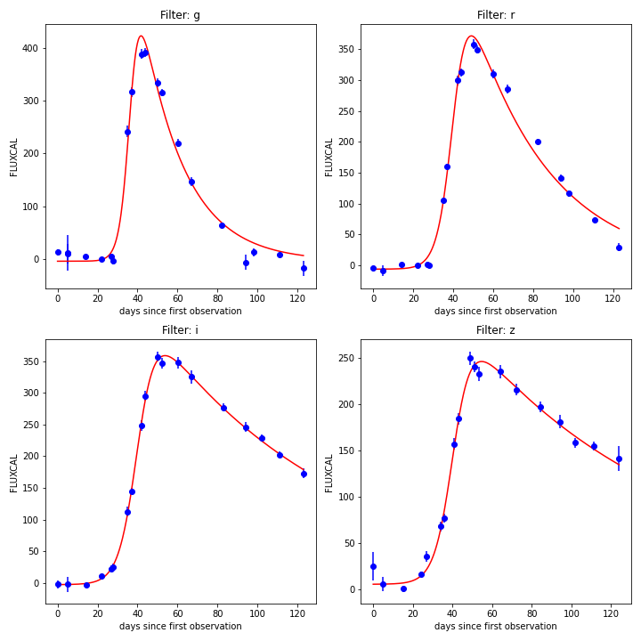
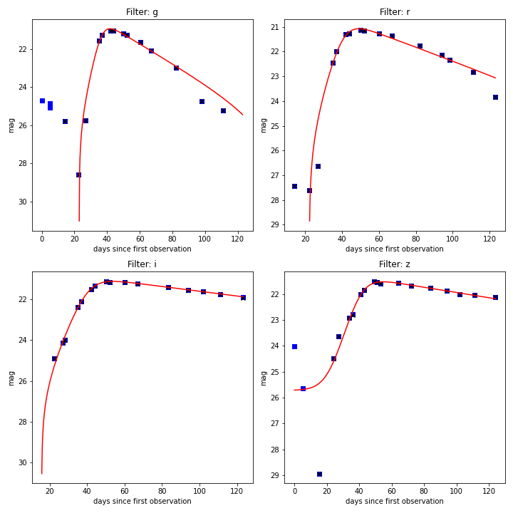
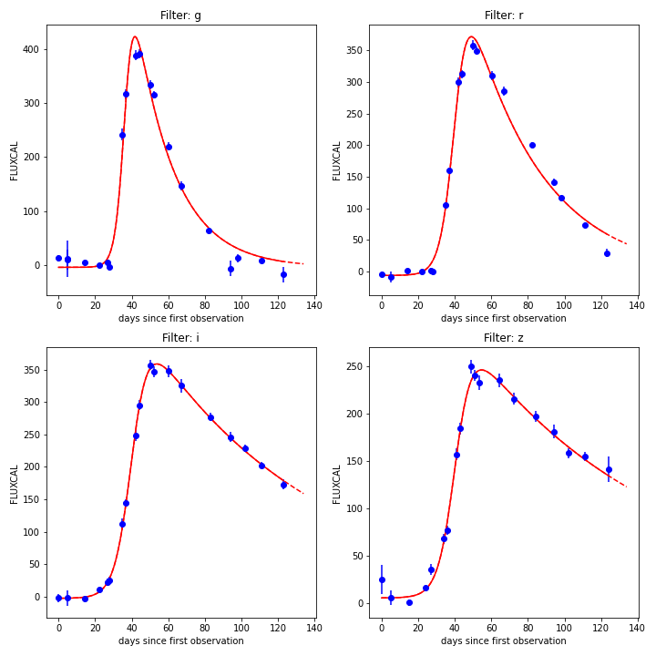

.. _preprocessing:

Feature Extraction
==================

The first stage in consists in transforming the raw data into a uniform data matrix which will subsequently be given
as input to the learning algorithm.

``resspect`` can handle FITS format data from the RESSPECT project, csv data from the Photometric LSST Astronomical Classification Challenge (`PLAsTiCC <https://zenodo.org/record/2539456#.Xrsk33UzZuQ>`_)  and text-like data from the SuperNova Photometric Classification Challenge (`SNPCC <https://arxiv.org/abs/1008.1024>`_).

Before starting any analysis, you need to choose a feature extraction method, all light curves will then be handdled by this method. In the examples below we used the Bazin feature extraction method  (`Bazin et al., 2009 <https://arxiv.org/abs/0904.1066>`_ ) or the Malanchev feature extraction method (`Malanchev et al., 2021 <https://arxiv.org/abs/2012.01419>`_ ).

Load 1 light curve:
-------------------

For SNPCC using Bazin features:
^^^^^^^^^^

The raw data looks like this:

.. literalinclude:: images/DES_SN729076.DAT
 :lines: 1-61

You can load this data using:

.. code-block:: python
   :linenos:

   >>> from resspect import BazinFeatureExtractor

   >>> path_to_lc = 'data/SIMGEN_PUBLIC_DES/DES_SN729076.DAT'

   >>> lc = BazinFeatureExtractor()             # create light curve instance
   >>> lc.load_snpcc_lc(path_to_lc)             # read data

This allows you to visually inspect the content of the light curve:

.. code-block:: python
   :linenos:

   >>> lc.photometry                            # check structure of photometry
             mjd band     flux  fluxerr   SNR
    0	56194.012	g	13.090	6.204	2.11	99.000	5.000
    1	56194.016	r	-4.680	3.585	-1.31	99.000	5.000
    ...	...	...	...	...	...	...	...
    75	56317.051	i	173.200	7.661	22.60	21.904	0.049
    76	56318.035	z	141.000	13.720	10.28	22.127	0.111

For SNPCC using Malanchev features:
^^^^^^^^^^

You can load the data using:

.. code-block:: python
   :linenos:

   >>> from resspect import MalanchevFeatureExtractor

   >>> path_to_lc = 'data/SIMGEN_PUBLIC_DES/DES_SN729076.DAT'

   >>> lc = MalanchevFeatureExtractor()         # create light curve instance
   >>> lc.load_snpcc_lc(path_to_lc)             # read data

This allows you to visually inspect the content of the light curve:

.. code-block:: python
   :linenos:

   >>> lc.photometry                            # check structure of photometry
             mjd band     flux  fluxerr   SNR
    0	56194.012	g	13.090	6.204	2.11	99.000	5.000
    1	56194.016	r	-4.680	3.585	-1.31	99.000	5.000
    ...	...	...	...	...	...	...	...
    75	56317.051	i	173.200	7.661	22.60	21.904	0.049
    76	56318.035	z	141.000	13.720	10.28	22.127	0.111

Fit 1 light curve:
------------------

For SNPCC using Bazin features:
^^^^^^^^^^

In order to feature extraction in one specific filter, you can do:

.. code-block:: python
   :linenos:

   >>> lc.fit('r')
   [514.92432962  -5.99556655  40.59581991  40.03343317   3.74307339]

The designation for each parameter are stored in:

.. code-block:: python
   :linenos:

   >>> lc.features_names
   ['a', 'b', 't0', 'tfall', 'trise']

It is possible to perform the fit in all filters at once and visualize the result using:

.. code-block:: python
   :linenos:

   >>> lc.fit_all()                            # perform fit in all filters
   >>> lc.plot_fit(save=True, show=True,
   >>>             output_file='plots/SN' + str(lc.id) + '_flux.png')   # save to file

   Example of light curve from SNPCC simulations.

This can be done in flux as well as in magnitude:

.. code-block:: python
    :linenos:

    >>> lc.plot_fit(save=False, show=True, unit='mag')

    Example of light from SNPCC data.

Ocasionally, it is necessary to extrapolate the fitted light curve to a latter epoch -- for example, in case we want to estimate its magnitude at the time of spectroscopic measurement (details in the `time domain preparation section <https://resspect.readthedocs.io/en/latest/prepare_time_domain.html>`_ ).

Before deploying  large batches for pre-processing, you might want to visualize how the extrapolation behaves for a few light curves. This can be done using:

.. code-block:: python
    :linenos:

    >>> # define max MJD for this light curve
    >>> max_mjd = max(lc.photometry['mjd']) - min(lc.photometry['mjd'])

    >>> lc.plot_fit(save=False, show=True, extrapolate=True,
    >>>                   time_flux_pred=[max_mjd+3, max_mjd+5, max_mjd+10])

    Example of extrapolated light from SNPCC data.

For SNPCC using Malanchev features:
^^^^^^^^^^

In order to feature extraction in one specific filter, you can do:

.. code-block:: python
   :linenos:

   >>> lc.fit('r')
   [1.03403418e+00, 3.60823443e+02, 7.24896424e+02, 8.86255944e-01,
    6.03107809e+01, 1.23027000e+02, 2.50709726e+02, 6.38344483e+01,
    5.19719109e+01, 6.31578947e-01, 1.22756021e+00, 2.41334828e-02,
    6.15343688e+02]

The designation for each parameter are stored in:

.. code-block:: python
   :linenos:

   >>> lc.features_names
   ['anderson_darling_normal', 'inter_percentile_range_5', 'chi2',
    'stetson_K', 'weighted_mean', 'duration', 'otsu_mean_diff',
    'otsu_std_lower', 'otsu_std_upper', 'otsu_lower_to_all_ratio',
    'linear_fit_slope', 'linear_fit_slope_sigma', 'linear_fit_reduced_chi2']

It is possible to perform the fit in all filters at once:

.. code-block:: python
   :linenos:

   >>> lc.fit_all()                            # perform fit in all filters

For PLAsTiCC:
^^^^^^^^^^^^^

Reading only 1 light curve from PLAsTiCC requires an object identifier. This can be done by:

.. code-block:: python
    :linenos:

    >>> import pandas as pd

    >>> path_to_metadata = '~/plasticc_train_metadata.csv'
    >>> path_to_lightcurves = '~/plasticc_train_lightcurves.csv.gz'

    # read metadata for the entire sample
    >>> metadata = pd.read_csv(path_to_metadata)

    # check keys
    >>> metadata.keys()
    Index(['object_id', 'ra', 'decl', 'ddf_bool', 'hostgal_specz',
           'hostgal_photoz', 'hostgal_photoz_err', 'distmod', 'mwebv', 'target',
           'true_target', 'true_submodel', 'true_z', 'true_distmod',
           'true_lensdmu', 'true_vpec', 'true_rv', 'true_av', 'true_peakmjd',
           'libid_cadence', 'tflux_u', 'tflux_g', 'tflux_r', 'tflux_i', 'tflux_z',
           'tflux_y'],
         dtype='object')

    # choose 1 object
    >>> snid = metadata['object_id'].values[0]

    # create light curve object and load data
    >>> lc = BazinFeatureExtractor()
    >>> lc.load_plasticc_lc(photo_file=path_to_lightcurves, snid=snid)

Processing all light curves in the data set
-------------------------------------------

There are 2 way to perform the Bazin fits for all three data sets. Using a python interpreter,

For SNPCC using Bazin features:
^^^^^^^^^^

.. code-block:: python
   :linenos:

   >>> from resspect import fit_snpcc

   >>> path_to_data_dir = 'data/SIMGEN_PUBLIC_DES/'            # raw data directory
   >>> features_file = 'results/Bazin.csv'                     # output file
   >>> feature_extractor = 'bazin'

   >>> fit_snpcc(path_to_data_dir=path_to_data_dir, features_file=features_file)

For SNPCC using Malanchev features:
^^^^^^^^^^

.. code-block:: python
   :linenos:

   >>> from resspect import fit_snpcc

   >>> path_to_data_dir = 'data/SIMGEN_PUBLIC_DES/'            # raw data directory
   >>> features_file = 'results/Malanchev.csv'                 # output file
   >>> feature_extractor = 'malanchev'

   >>> fit_snpcc(path_to_data_dir=path_to_data_dir, features_file=features_file)

For PLAsTiCC:
^^^^^^^^^^^^^

.. code-block:: python
   :linenos:

   >>> from resspect import fit_plasticc

   >>> path_photo_file = '~/plasticc_train_lightcurves.csv'
   >>> path_header_file = '~/plasticc_train_metadata.csv.gz'
   >>> output_file = 'results/PLAsTiCC_Bazin_train.dat'
   >>> feature_extractor = 'bazin'

   >>> sample = 'train'

   >>> fit_plasticc(path_photo_file=path_photo_file,
   >>>              path_header_file=path_header_file,
   >>>              output_file=output_file,
   >>>              feature_extractor=feature_extractor,
   >>>              sample=sample)

The same result can be achieved using the command line:

.. code-block:: bash
    :linenos:

    # for SNPCC
    >>> fit_dataset -s SNPCC -dd <path_to_data_dir> -o <output_file>

    # for PLAsTiCC
    >>> fit_dataset -s <dataset_name> -p <path_to_photo_file>
             -hd <path_to_header_file> -sp <sample> -o <output_file>

